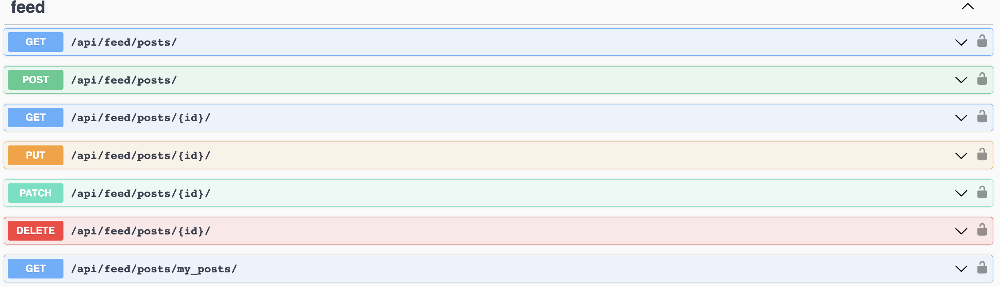

# Social Media API

This is a Django RESTful API for a social media platform that allows users to create profiles, follow other users, create and retrieve posts and perform basic social media actions.


### Profile features

- Users can create and update their profile, including profile picture, bio, and other details.
- Users can retrieve their own profile and view profiles of other users.
- Users can follow and unfollow other users.

- Users can search for users by username or city.


### Post features

- Users can create new posts with text content.
- Users can retrieve their own posts and posts of users they are following.


- Users can retrieve posts by hashtags or other criteria.
- Custom pagination for posts


### User Registration and Authentication

- Social Media API uses JWT authentication.
- Users can register with their email and password to create an account.
- Users can login with their credentials and receive a token for authentication.
- Users can logout and invalidate their token.


### API Permissions

- Only authenticated users can perform actions such as creating posts, following/unfollowing users.
- Users can only update and delete their own posts and profiles.

## How to run
<hr>

```shell
git clone https://github.com/MkrtychKhachatrian/social-media-api.git
cd social_media
python -m venv venv

(windows) -> venv\Scripts\activate
(linux) -> source venv/bin/activate

pip install -r requirements.txt
python manage.py runserver
```
